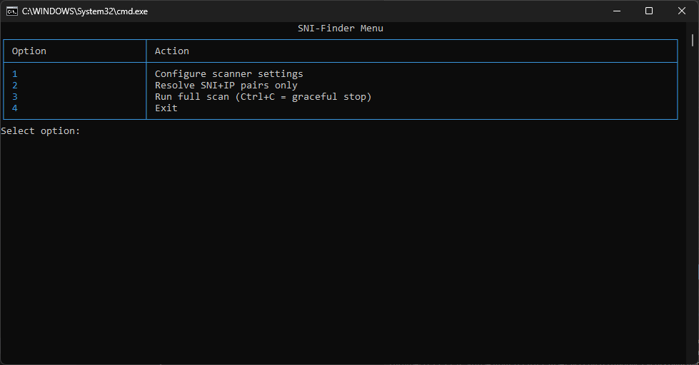
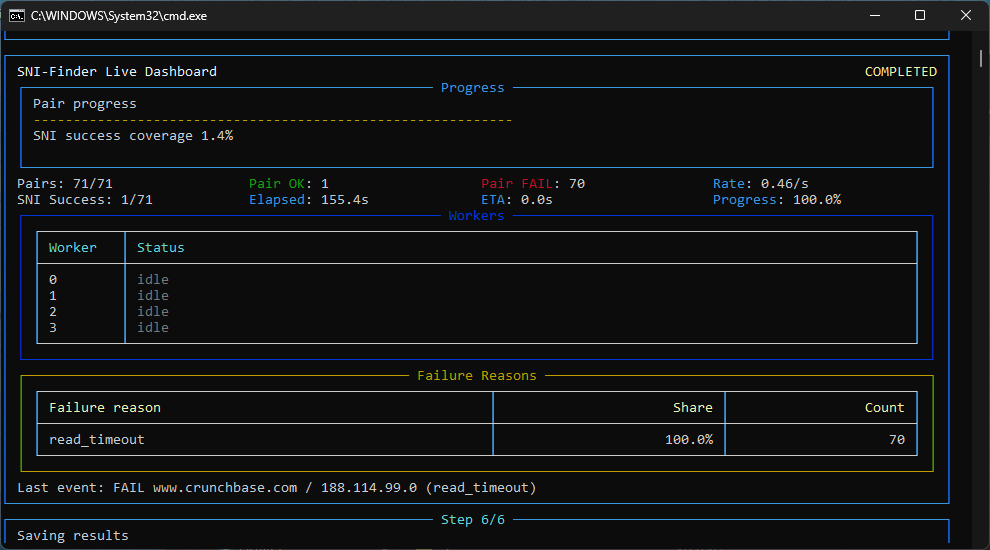

# 🚀 SNI-Finder Scanner

[](LICENSE)
[](https://github.com/NaxonM/SNI-Finder/releases)

An elite, high-performance SNI+IP scanner designed to discover DPI-resilient Server Name Indication (SNI) hostnames that survive SNI-based deep packet inspection. By combining a triple-chained architecture, the scanner verifies the accessibility of Cloudflare-fronted domains with millisecond precision.

### 🔗 Triple-Chained Architecture
1. **SNISPF Core** — Intercepts packets and executes strict `wrong_seq` DPI bypass techniques for each target pair.
2. **Xray Core** — Standard anti-censorship client configured with VLESS/Trojan outbounds directed at the local SNISPF instance.
3. **HTTP Probe** — Dispatches real-world SOCKS5h requests over Xray's interface to verify actual internet access and records latency.

> 🇮🇷 ** Persian/Farsi Guide:** [README_fa.md](README_fa.md)

---

## ⚡ Quick Start (GitHub Releases)

The recommended way to start is using our pre-built release bundles which come pre-configured with Xray and SNISPF runtimes.

### 1. Download & Extract
Download the bundle for your platform from [GitHub Releases](https://github.com/NaxonM/SNI-Finder/releases):
* **Windows**: `sni-finder_windows_amd64_bundle.zip`
* **Linux**: `sni-finder_linux_amd64_bundle.tar.gz`

Extract the folder and open a terminal inside it.

### 2. Configure Sourcing
Add one SNI domain per line to `config/sni-list.txt` or read our **[Guide on Sourcing Cloudflare SNIs](docs/sourcing_snis.md)** to find elite, high-resilience domains (including our automated Tranco Top Sites processor).

### 3. Launch the Scanner

#### 🪟 Windows
Double-click `start.bat` or run it from terminal:
```powershell
.\start.bat
```
* **Self-Elevation**: `start.bat` automatically requests **Administrator privileges** via UAC. This is strictly required on Windows to perform raw WinDivert packet injection (`wrong_seq` fragmentation).
* **Automatic Setup & Fast Bypass**: Checks if the required libraries (`requests`, `socks`, `rich`) are already installed. If not, it automatically installs them from `requirements.txt`. On subsequent runs, it bypasses this check instantly (takes less than a second) for a zero-lag startup.

#### 🐧 Linux
Mark the script as executable and run it:
```bash
chmod +x ./start.sh
sudo ./start.sh
```
* **Privileges**: Requires `sudo` (root or `CAP_NET_RAW` capabilities) to handle raw socket operations.
* **Workspace Sandbox & Dependency Management**: `start.sh` checks for, creates, and activates a Python **virtual environment (`venv`)** locally to sandbox dependencies. It verifies and installs the required packages automatically on the first run, and instantly bypasses the check on subsequent runs.

### 4. Setup & Scan
- **First Run**: An interactive configuration wizard will prompt you to paste your `vless://` or `trojan://` proxy URI.
- **MainMenu**: Press `1` (or hit **Enter**) to run the scan. Press `Ctrl+C` at any time to gracefully stop.

---

## 📊 Live Dashboard & Screenshots

SNI-Finder features an interactive, flicker-free terminal interface powered by `rich`.

| Main Menu | Active Scan |
| :---: | :---: |
|  |  |

---

## 🌟 Key Features

* **Subnet Filtering**: Instantly filters resolved IPs against the Cloudflare subnets list (`config/cf_subnets.txt`) before scanning.
* **Parallel Performance**: Parallel multi-threaded workers with isolated port mappings (`24000+` for SNISPF, `25000+` for Xray) to scan hundreds of domains in seconds.
* **Safety First**: Features high-precision PID-based termination of background worker processes, ensuring it **never** kills external VPN/Xray clients like **v2rayN**.
* **Failure Analysis**: Real-time error categorization (e.g., `port_conflict`, `read_timeout`, `tls_error`) shown on a live status dashboard.

---

## 📂 Project Structure

```
SNI-Finder/
├── config/
│   ├── cf_subnets.txt        # Cloudflare subnet database
│   ├── sni-list.txt          # Target list of SNI domains
│   └── scanner_settings.json # Saved scan parameters
├── docs/
│   └── sourcing_snis.md      # Detailed guide for finding SNIs
├── scripts/
│   ├── extract_cf_from_tranco.py # Automatic Tranco CSV filter
│   └── build_release_bundles.py # Bundle generation script
├── logs/
│   └── scanner.log           # Master scan logs
├── results/
│   └── latest.json           # Symlink to latest run artifacts
└── LICENSE                   # GNU GPL v3 License
```

---

## 🛡️ License

This project is licensed under the **GNU General Public License v3.0** - see the [LICENSE](LICENSE) file for details.
