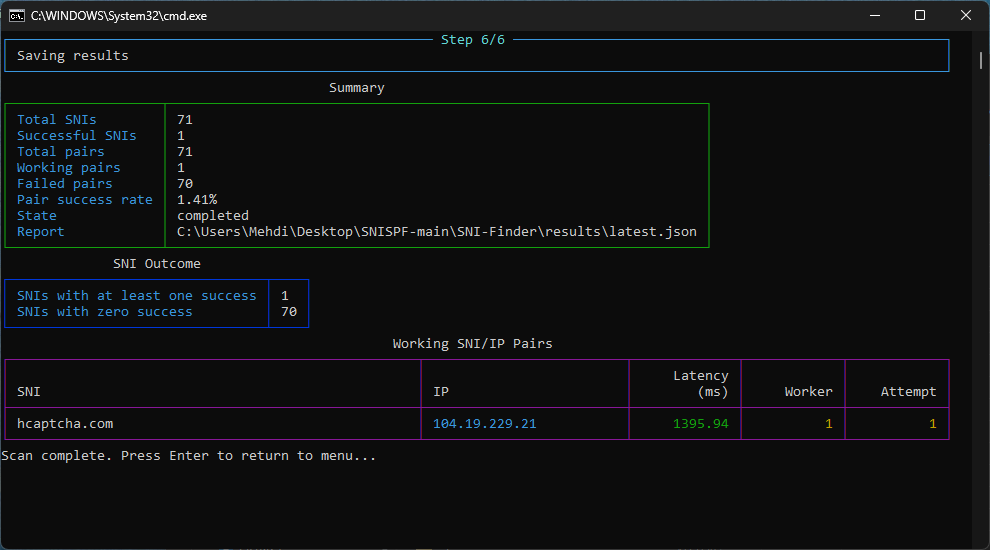
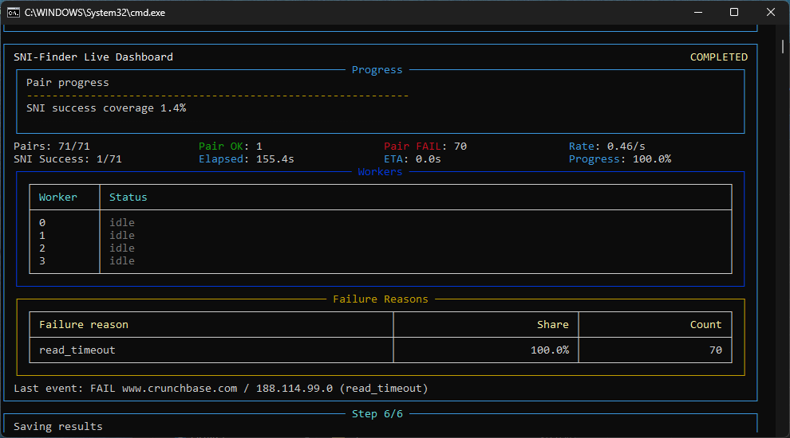
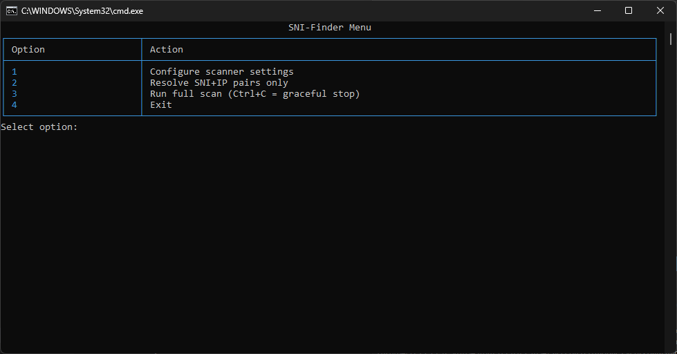

# SNI-Finder Scanner

SNI-Finder جفت هاي SNI+IP را با اين زنجيره اسکن مي کند:

1. اجراي SNISPF در حالت سخت گيرانه `wrong_seq` براي هر جفت.
2. اجراي Xray با outbound از نوع VLESS که به SNISPF محلي وصل است.
3. ارسال درخواست HTTP از طريق SOCKS در Xray براي تشخيص سالم بودن جفت.

English guide: [README.md](README.md)

## شروع سريع با نسخه هاي Release (پيشنهادي)

اگر مي خواهيد با نسخه آماده Release اسکن SNI انجام دهيد، اين مراحل را انجام دهيد:

1. از GitHub Releases فايل مناسب سيستم عامل را دانلود کنيد:
  - ويندوز: `sni-finder_windows_amd64_bundle.zip`
  - لينوکس: `sni-finder_linux_amd64_bundle.tar.gz`
2. فايل را Extract کنيد و ترمينال را داخل پوشه استخراج شده باز کنيد.
3. فايل `config/sni-list.txt` را ويرايش کنيد و در هر خط يک SNI قرار دهيد.
4. اسکنر را اجرا کنيد:

ويندوز (حتما با Administrator):

```powershell
cd sni-finder_windows_amd64_bundle
.\start.bat
```

لينوکس (حتما با دسترسي لازم):

```bash
cd sni-finder_linux_amd64_bundle
chmod +x ./start.sh
sudo ./start.sh
```

5. در اجراي اول:
  - لانچر وابستگي هاي Python را چک مي کند و در صورت نياز نصب مي کند.
  - اگر `vless_source` خالي باشد، تنظيم تعاملي خودکار شروع مي شود.
6. شروع اسکن:
  - از منو گزينه `Run Scan` را بزنيد، يا
  - مستقيم اجرا کنيد: `python3 scanner.py run`
7. خروجي را در اين فايل ها ببينيد:
  - `results/latest.json`
  - `results/<timestamp>/working_pairs.txt`
  - `logs/scanner.log`

## اسکرين شات ها







## قابليت ها

- خواندن ليست SNI از `config/sni-list.txt`
- Resolve کردن SNI ها به IPv4
- فيلتر کردن جفت ها فقط در ساب نت هاي Cloudflare
- اسکن موازي با worker هاي مستقل
- داشبورد زنده Rich و گزارش علت خطاها
- ذخيره کامل نتايج و لاگ هر اجرا

## پيش نيازها

- Python 3.10 يا بالاتر
- يک VLESS معتبر
- باينري هاي SNISPF و Xray

ويندوز:

- PowerShell را به صورت Administrator اجرا کنيد (براي `wrong_seq` و WinDivert)
- فايل هاي زير در `bin/` باشند:
  - `snispf_windows_amd64.exe`
  - `xray.exe`
  - `WinDivert.dll`
  - `WinDivert64.sys`

لينوکس:

- براي `wrong_seq` دسترسي لازم داشته باشيد (root يا `CAP_NET_RAW`)
- فايل هاي زير در `bin/` باشند:
  - `snispf_linux_amd64` (يا arm64)
  - `xray`

متغيرهاي اختياري براي مسير ابزارها:

- `SNI_FINDER_SNISPF_BIN`
- `SNI_FINDER_XRAY_BIN`

اين متغيرها مي توانند مسير کامل، مسير نسبي پروژه يا نام دستور در PATH باشند.

## نصب

```bash
cd SNI-Finder
python3 -m pip install -r requirements.txt
```

## تنظيمات

`vless_source` را با يکي از حالت هاي زير تنظيم کنيد:

- لينک کامل `vless://...`
- مسير فايل txt که داخلش `vless://...` است
- مسير فايل JSON از Xray که outbound نوع VLESS دارد

تنظيم تعاملي:

```bash
python3 scanner.py configure
```

فايل تنظيمات: `config/scanner_settings.json`

## اجرا

اجراي سريع با اسکریپت هاي لانچ:

- ويندوز: `start.bat`
- لينوکس: `sudo ./start.sh`

حالت منو:

```bash
python3 scanner.py
```

اسکن مستقيم:

```bash
python3 scanner.py run
```

فقط Resolve:

```bash
python3 scanner.py resolve
```

اجرا با VLESS موقت:

```bash
python3 scanner.py run --vless "vless://..."
```

توقف نرم:

- هنگام اسکن `Ctrl+C` بزنيد
- worker هاي فعال cleanup مي شوند و بعد برنامه مي بندد

## ساخت بسته انتشار (Windows + Linux)

اسکريپت انتشار به صورت خودکار آخرين نسخه پايدار را مي گيرد:

- SNISPF از `NaxonM/snispf-core`
- Xray از `XTLS/Xray-core`

ويندوز:

```powershell
powershell -ExecutionPolicy Bypass -File .\scripts\build_release_bundles.ps1
```

لينوکس:

```bash
bash ./scripts/build_release_bundles.sh
```

خروجي:

- `release/sni-finder_windows_amd64_bundle.zip`
- `release/sni-finder_linux_amd64_bundle.tar.gz`
- `release/checksums.txt`
- `release/release_manifest.json`

## انتشار با GitHub Actions (پيشنهادي)

انتشار نهايي را با workflow انجام دهيد و فايل هاي generated را commit نکنيد.

فايل workflow: `.github/workflows/release.yml`

- `workflow_dispatch`: ساخت باندل براي تست/بررسي
- push تگ با الگوي `v*`: ساخت باندل و انتشار خودکار روي GitHub Releases

نمونه انتشار با تگ:

```bash
git tag v0.1.0
git push origin v0.1.0
```

## خروجي هاي اجرا

- `results/latest.json`
- `results/<timestamp>/summary.json`
- `results/<timestamp>/working_pairs.json`
- `results/<timestamp>/failed_pairs.json`
- `results/<timestamp>/working_pairs.txt`
- `logs/scanner.log`

## نکته ها

- فايل `config/cf_subnets.txt` اجباري است.
- جفت هاي خارج از رنج Cloudflare قبل از اسکن حذف مي شوند.
